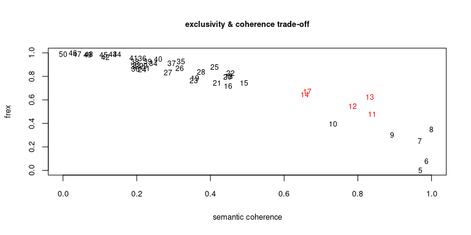
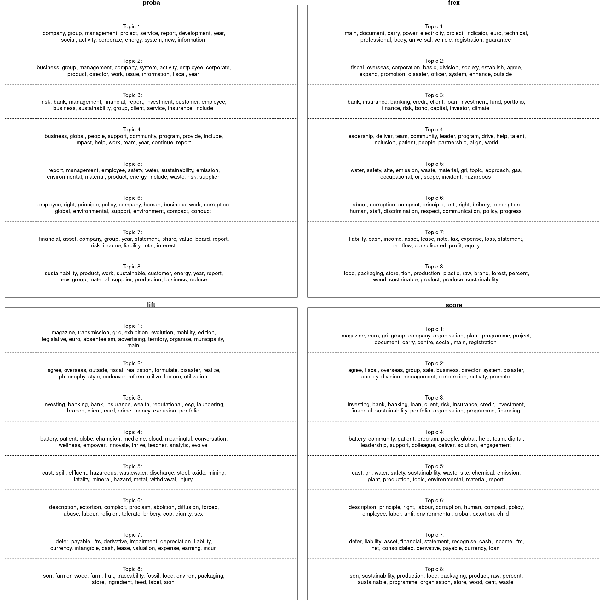
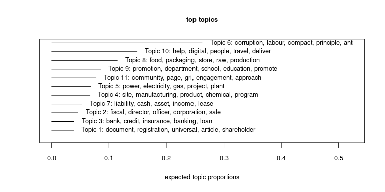
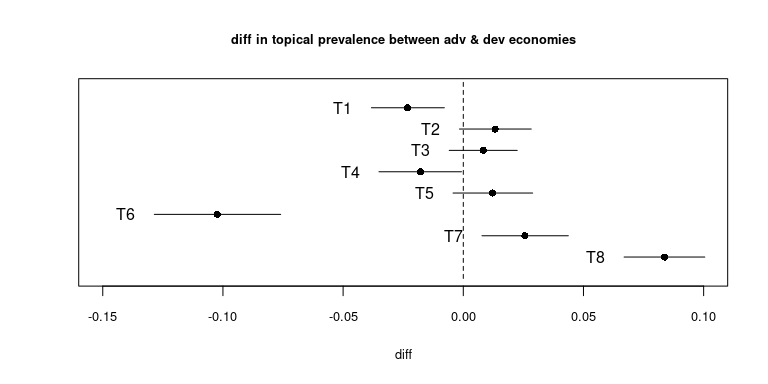
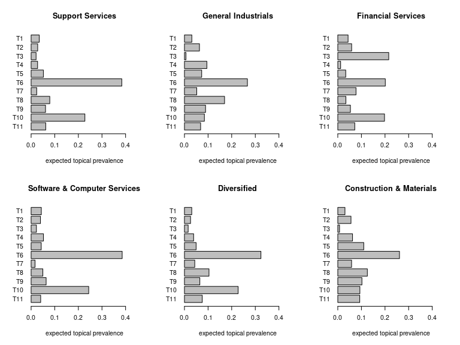
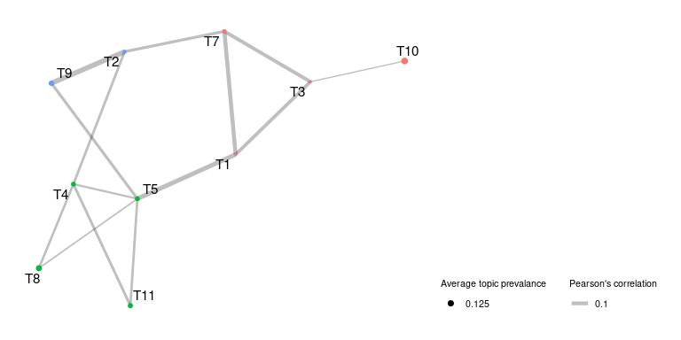
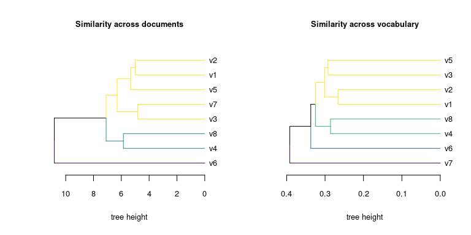

Corporate social responsibility - topic modeling report
================

> Martin Fridrich 11/2021

This document aims to preprocess the CSsR reports, examine properties of
the resulting dataset, find a viable topic model, and present imprinted
perspectives.

## Data loading

``` r
# load
data_dir = "..//..//data//"
csv_to_load = paste0(data_dir, list.files(data_dir, pattern="texts.csv"))
docs = data.table::fread(csv_to_load, data.table=F, na.strings="", nThread=4)
colnames(docs)[1] = "doc_id"
colnames(docs) = janitor::make_clean_names(colnames(docs))

# prepare for stm objects
out = textProcessor(documents=docs$reconstructed_chars,
  metadata=docs, lowercase=F, removestopwords=F,
  removenumbers=F, removepunctuation=F, stem=F)
```

    ## Building corpus... 
    ## Creating Output...

## Structural topic model

``` r
formula = as.formula("~economy_type")
evaluate_topics = function(k, out, formula){
  require(stm, quietly=T)
  fit = stm(documents=out$documents, vocab=out$vocab, data=out$meta,
    prevalence=formula, verbose=F, K=k, seed=k, max.em.its=750,
    init.type="Spectral")
  sc = mean(semanticCoherence(fit, out$documents))
  frex = mean(exclusivity(fit))
  return(c(k, sc, frex))}

print("Starting hyperparam sweep for number of topics...")
```

    ## [1] "Starting hyperparam sweep for number of topics..."

``` r
st =  Sys.time()
cl = makeCluster(4)
sweep_df = parSapply(cl, 5:50,
  FUN=evaluate_topics, out=out, formula=formula)
stopCluster(cl)
print(paste0("The procedure finished in ", format(Sys.time()-st, digits=2) ,"."))
```

    ## [1] "The procedure finished in 1.6 hours."

``` r
colnames(sweep_df) = NULL; rownames(sweep_df) = c("k", "semcoh", "frex");
sweep_df = as.data.frame(t(sweep_df))
```

``` r
# min-max lin scale
scale_linear = function(x){
  x_range = range(x)
  scale_linear = (x-x_range[1])/(x_range[2]-x_range[1])
  return(scale_linear)}

# scale metrics
sweep_df[,c("semcoh_scaled", "frex_scaled")] = apply(sweep_df[,c('semcoh','frex')],
  2, scale_linear)
# distance from utopia
sweep_df$dist = ((1-sweep_df$frex_scaled)^2+(1-sweep_df$semcoh_scaled)^2)^(1/2)
max_dist =  arrange(sweep_df, dist) %>% select(dist) %>% slice(5) %>% unlist()

plot(x=sweep_df$semcoh_scaled, y=sweep_df$frex_scaled, type='n',
  main="exclusivity & coherence trade-off",xlab='semantic coherence', ylab='frex',
  cex.main=0.8, cex.axis=0.8, cex.lab=0.8)

for(r in 1:nrow(sweep_df)){
  text(x=sweep_df$semcoh_scaled[r], y=sweep_df$frex_scaled[r], label=sweep_df$k[r],
    cex=0.75, col = ifelse(sweep_df$dist[r]<=max_dist,"red","black"))}
```



``` r
n_topics = 11
stm_model = stm(documents=out$documents, vocab=out$vocab, data=out$meta,
  prevalence=formula, verbose=F, K=n_topics, seed=n_topics, max.em.its=750,
  init.type="Spectral")
```

### Labeling

``` r
par(mfrow=c(2,2), mar=c(1,1,1,1))
plot(stm_model, type="labels", labeltype = "prob", main="proba",
  cex.main=1.5, text.cex=1.3, n=15)
plot(stm_model, type="labels", labeltype = "frex", main="frex",
  cex.main=1.5, text.cex=1.3, n=15)
plot(stm_model, type="labels", labeltype = "lift", main="lift",
  cex.main=1.5, text.cex=1.3, n=15)
plot(stm_model, type="labels", labeltype = "score", main="score",
  cex.main=1.5, text.cex=1.3, n=15)
```



``` r
# top docs per topic
ft = findThoughts(stm_model, texts=out$meta$reconstructed_chars,
  topics=1:stm_model$settings$dim$K, n=3, meta=out$meta)
ft_df = lapply(names(ft$index),
  function(x) data.frame(topic = rep(x, length(ft$index[x])),
    index = ft$index[x][[1]])) %>% data.table::rbindlist() %>%
    as.data.frame()
mirror_cols = c("doc_id", "participant", "reconstructed_chars", "output_chars", "economy_type")
ft_df[, mirror_cols] = out$meta[ft_df$index, mirror_cols]
ft_df[, c("doc_id", "participant", "reconstructed_chars")] %>%
  mutate(reconstructed_chars=substr(reconstructed_chars,1,200)) %>% as_tibble()
```

    ## # A tibble: 33 × 3
    ##    doc_id participant                            reconstructed_chars            
    ##     <int> <chr>                                  <chr>                          
    ##  1   1926 Rexel Group                            "rent fee share capital regist…
    ##  2   1974 SODEXO IBERIA S.A                      "woe version registration docu…
    ##  3    325 Ascom Holding AG                       "annual report global solution…
    ##  4   2274 Tokyo Century Corporation              "century report commitment run…
    ##  5   1329 Komatsu Ltd.                           "tee eat day wee enhance quali…
    ##  6   2141 Sumitomo Riko Company Limited          "com eye global excellent manu…
    ##  7   2156 Svenska Handelsbanken AB (publ)        "found bank branch network way…
    ##  8   1580 Movestic Livforsakring AB              "sustainability digital develo…
    ##  9   2053 SharePower Responsible Investing, Inc. "responsible invest die lie pe…
    ## 10   2355 Viatris                                "global social responsibility …
    ## # … with 23 more rows

### Prevalence

``` r
# topic prevalence & props
plot(stm_model, type='summary', labeltype='frex', main="top topics",
  xlab="expected topic proportions", cex.lab=0.8, cex.axis=0.8, text.cex=0.8,
  cex.main=0.8, n=5)
```



### Covariates

``` r
estimated_effect = estimateEffect(1:stm_model$settings$dim$K ~ economy_type, stm_model,
  meta=out$meta, documents=out$documents, uncertainty="Global", nsims=250)
plot(estimated_effect, model=stm_model, topics=1:stm_model$settings$dim$K, method="difference",
  covariate="economy_type", cov.value1="Advanced", cov.value2 = "Developing",
  xlim=c(-0.15,0.1), verbose.labels=F, main="diff in topical prevalence between adv & dev economies",
  labeltype="custom", custom.labels = paste0("T", 1:stm_model$settings$dim$K),
  xlab = "diff", cex.main=0.8, cex.axis=0.8, cex.lab=0.8)
```



``` r
# prevalence across the sector
sector_prevalence = stm_model$theta %>% as.data.frame() %>%
  mutate(sector=docs$sector) %>% group_by(sector) %>%
  summarise(across(everything(), mean), n=n()) %>%
  arrange(desc(n))

par(mfrow=c(2,3))
for (i in 1:6){
sector = sector_prevalence$sector[i]
barplot(as.matrix(sector_prevalence[i,12:2]),
  names.arg = paste0("T",11:1), xlim=c(0,.45),
  col="gray", horiz=T, las=1, xlab="expected topical prevalence", main=sector)}
```



### Similarity

The topic model allows for correlation between topics; positive
correlation suggests that both subjects are likely to be discussed
within one doc. We construct a network with positive correlations
between factors.

``` r
corr_mat = Hmisc::rcorr(stm_model$theta)
edges = which(corr_mat$r>0 & corr_mat$r!=1, arr.ind = T)
edges_df = as.data.frame(edges)
edges_df$value = corr_mat$r[edges]
edges_df = edges_df[edges_df$row>edges_df$col,]
nodes_df = data.frame(name=1:stm_model$settings$dim$K,
  proportion=colMeans(stm_model$theta)) %>%
  filter(name %in% edges_df$row | name %in% edges_df$col)

tc_net = graph_from_data_frame(edges_df, vertices=nodes_df, directed=F) %>%
  as_tbl_graph(tc_net) %>%
  mutate(community=as.factor(group_fast_greedy()))

ggraph(tc_net, 'kk')+
  geom_edge_link(aes(width=value), alpha=0.25)+
  scale_edge_width(range = c(0.5, 2), breaks = c(0.1,0.2,0.3))+
  geom_node_point(aes(size=proportion, colour=community))+
  scale_size(range = c(0.5, 2), breaks = c(0.125, 0.15, 0.175))+
  geom_node_text(aes(label=paste0("T", name)), size=4, repel=T)+
  theme_graph(base_family = 'sans',
    base_size = 10, background='white',plot_margin = margin(15, 15, 15, 15))+
  theme(legend.title=element_text(size=8),
    legend.text=element_text(size=8), legend.justification=c(0,0),
      legend.box = "horizontal")+guides(color="none")+
    labs(edge_alpha='Pearson\'s correlation', edge_width='Pearson\'s correlation',
      size='Average topic prevalance')
```



### New summary

``` r
stmprinter::plot_thoughts(stm_model, out$meta$reconstructed_chars, n_sentences=25, split_width=62, cutoff = 190)
```


``` r
# topics within docs
plot_jsd_tree = function(mat, n, label){
  suppressPackageStartupMessages(require(dendextend, quietly=T))
  hclust = hclust(as.dist(mat), method="ward.D")
  #par(mar=c(5,1,1,20))
  as.dendrogram(hclust) %>% dendextend::set("branches_k_color",
    value=viridis::viridis(n=n), k=n) %>%
    plot(xlab="tree height", cex.main=.8, cex.axis=.8, cex.lab=.8,
      horiz=T, main=label, nodePar=list(lab.cex=.8, pch=NA, cex=.8))}

doc_dist_mat = sqrt(philentropy::JSD(t(stm_model$theta), unit="log10"))
```

    ## Metric: 'jensen-shannon' using unit: 'log10'; comparing: 11 vectors.

``` r
voc_dist_mat = sqrt(philentropy::JSD(exp(stm_model$beta$logbeta[[1]]), unit="log10"))
```

    ## Metric: 'jensen-shannon' using unit: 'log10'; comparing: 11 vectors.

``` r
par(mfrow=c(1,2))
plot_jsd_tree(doc_dist_mat, 3, "Similarity across documents")
plot_jsd_tree(voc_dist_mat, 4, "Similarity across vocabulary")
```



``` r
# cleanup environment
rm(list=setdiff(ls(), c("out", "stm_model", "estimated_effect")))
# push down image
save.image("../../data/stm_exported.RData")
```

``` r
stminsights::run_stminsights()
```

> Martin Fridrich 11/2021
